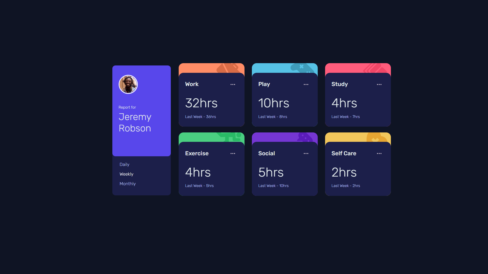

# Frontend Mentor - Time tracking dashboard solution

This is a solution to the [Time tracking dashboard challenge on Frontend Mentor](https://www.frontendmentor.io/challenges/time-tracking-dashboard-UIQ7167Jw). Frontend Mentor challenges help you improve your coding skills by building realistic projects. 

## Table of contents

- [Overview](#overview)
  - [The challenge](#the-challenge)
  - [Screenshot](#screenshot)
  - [Links](#links)
- [My process](#my-process)
  - [Built with](#built-with)
  - [What I learned](#what-i-learned)

## Overview

### The challenge

Users should be able to:

- View the optimal layout for the site depending on their device's screen size
- See hover states for all interactive elements on the page
- Switch between viewing Daily, Weekly, and Monthly stats

### Screenshot

### Links

- [Solution URL](https://github.com/mdajmalshadab/Front-End-Works/tree/main/Front-End-Junior/time-tracking-dashboard-main)
- [Live Site URL](https://mdajmalshadab.github.io/Front-End-Works/Front-End-Junior/time-tracking-dashboard-main/index.html)

## My process

### Built with

- HTML5
- CSS
- Bootstrap 
- Javascript

### What I learned

In this challenge I learned about 

- CSS grid 
- Importing data from .json file into javascript and using it into HTML elements
- Creating/Manipulating multiple HTML elements by using pure javascript
- Concept of `nth-child` in HTML element

